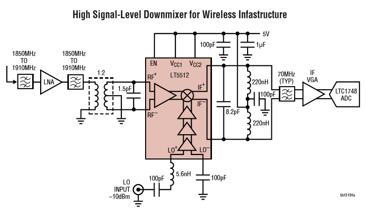

# Frequency Downconverter

In this project, a Frequency Downconverter (FDC) with RF input and 50ohm output impedance will be designed, simulated, manufactured and tested.

## Guide

### Group Meeting
 - [First Meeting Record](groupmeeting/first_meeting)

### AA Meeting
 - [First Meeting Record](aameeting/first_meeting)

## Objective

This is the LT5512 recommanded circuit..