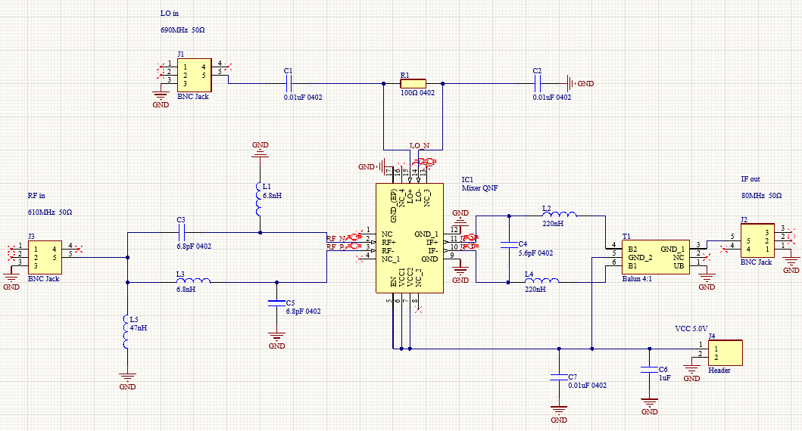

# Schematic Design

## Overview

Six steps were conducted in the circuit design produrce. The first step is to select a Mixer IC, which should accpet UHF signal and need to be in stock in UK. We selected LT5512 IC which can support up to 3GHz signal in this case. Secondly, impedance matching is processed in order to match standard 50Ω input and 50Ω output. In this case, capacitors and inductors were utilized to design with the help of Smith chart and online design tools. Thirdly, a Low Pass Filter function was considered while design the impedance matching in the IF part. Then, Differcial Line Design was tried to optimized the performance of signal transmission. Additionally, simmulation was conducted with ADS to verify the circuit performance.

## Component Selection and Purchase
The first produrce of component selection is figure out what we really needed. In this case, a mixer, three BNC jacks and one PCB header are necessary, while others such as transformses, amplifier, filters are optional. After confirm what we needed (the schametic), component selection can be proceeded. During the component selection, it is common and sometimes unavoidly unable to find a expected component. When this happened, a new purchase list in corresponding with a redesign schematic should be proceeded.

## Filter Design
In downconverter case, the less the ripples on the bandwidth, the better performance can be expected. After weigth the performance of the filter and the difficulty of the PCB design, we have choosed the one order Butterworth filter as well as designed the schematic to be as few filter as possible.

## Impedance Matching
Impedance matching is considered so that the circuit can accept a standard 50 ohms input and support a 50 ohms output. This design is conducted in the meantime with the filter design. Online tools from Analog Devices was utilized and Shmith Chart was tried to varified the design. A 50:200 ohms Balun transformer was implemented in the IF part to match the impedance.

## Differencial Line Design
As the LT5512 request a differencial RF input and IF output, several capacitiors was used to block the DC while a Balun was settled to transform IF signal from differencial to single side. 

## Simulation
ADS was used to check the expected performance of the design of impedance matching circuit. 
